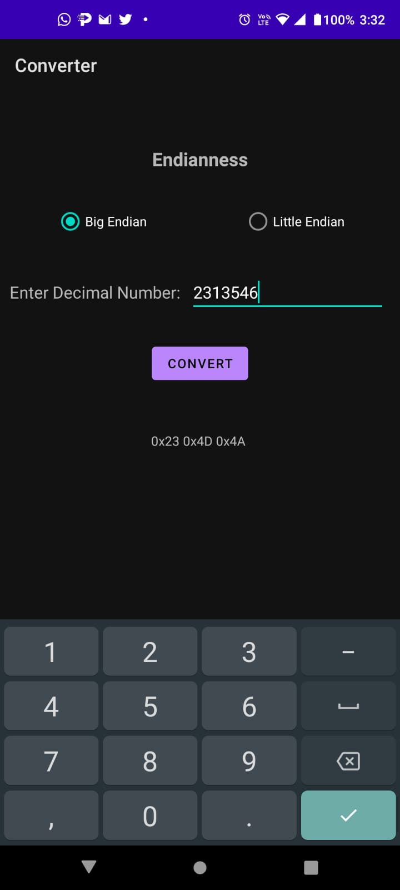
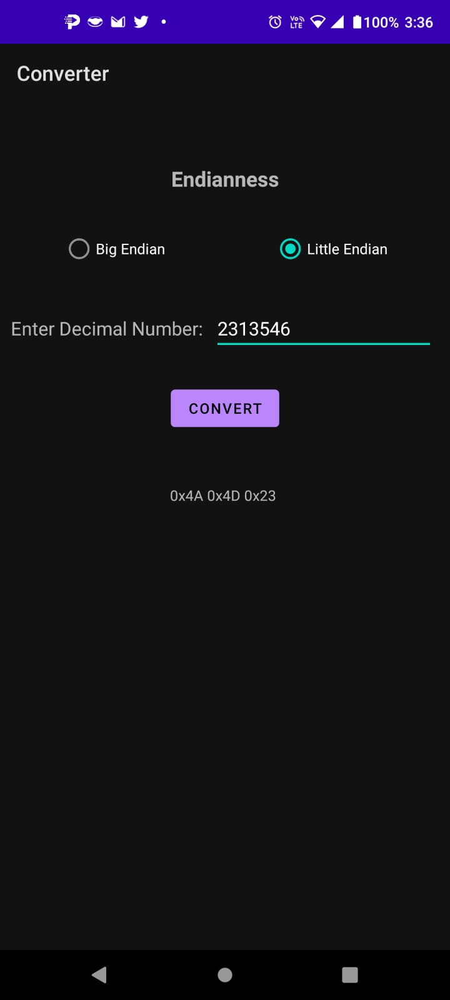

# Endianness

The endianness application provide a super easy way to convert decimal number into endian value.

## Features
The app use one of the simplest and easiest methods to convert from decimal to endian. Firstly the decimal number is converted into hex value, this process is execute as follow.
The number that is introduced by the user is divided by 16, this process is executed while the number is greater than zero; in every loop we get the remainder value. These values are used to get the hex value based on a table. The conversion table is as follows:

| Decimal | hex Digit |
| ------ | ------ |
| 0 | 0 |
| 1 | 1 |
| 2 | 2 |
| 3 | 3 |
| 4 | 4 |
| 5 | 5 |
| 6 | 6 |
| 7 | 7 |
| 8 | 8 |
| 9 | 9 |
| 10 | A |
| 11 | B |
| 12 | C |
| 13 | D |
| 14 | E |
| 15 | F |

Then the hex values are grouped in pairs to obtain the desired format of the endian value, based on the user selection.

# Installation

To install the app download the `apk` file from the link provided in the email that was sended to you.

### Note:
> You must give permissions to install apps from resources out of play store.

# Screenshots

 

